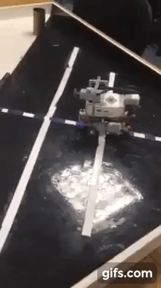
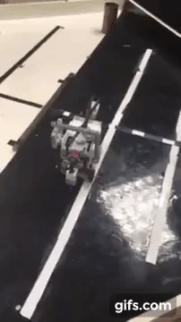
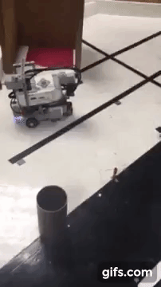
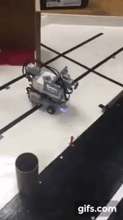

# Robotics Localization, Planning and Navigation

This is a robotics group project about implementing a robotics system under the LEJOS EV3 platform written in Java. The main function can be found under the RobotController.java. All classes are implemented in the same file due to the single file upload limitation of the LEJOS platform. The sequence of tasks it can perform is as follows:

1.Localization     
2.Conduct A* search to plan a path from localized point to the goal position  
3.Path Navigation according to planned path     
4.Enter into the U-shaped box     
5.Move until it touches the wall and make a beep sound 
6.Move back out from the U-shaped box to the previous goal point  
7.Conduct A* search again to plan a path from that goal point back to original starting position 
8.Path Navigation according to planned path     

